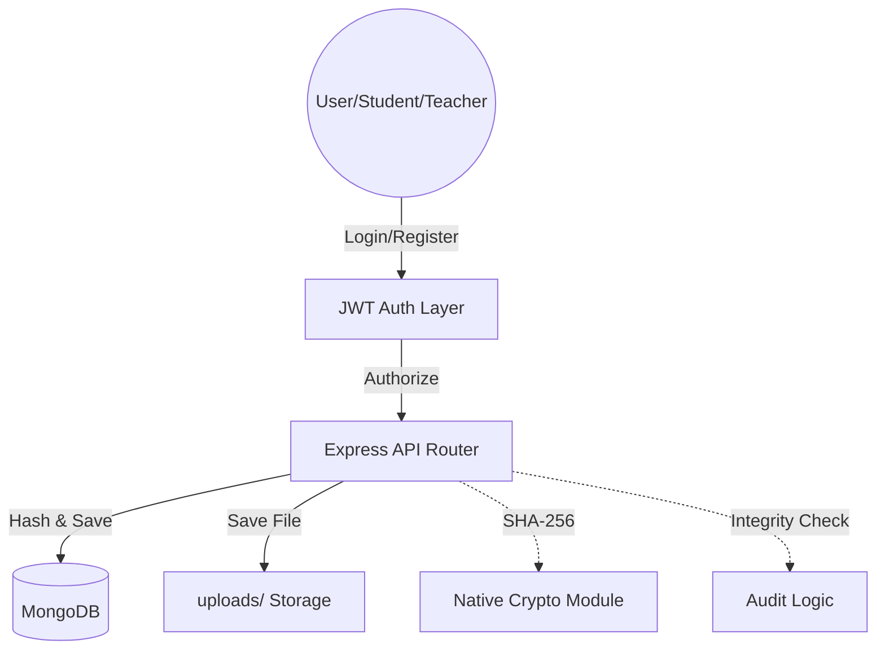

# HashGuard: Tamper-Proof Assignment Submission System

HashGuard is a full-stack, enterprise-grade assignment submission platform designed with **cryptographic integrity** at its core. By leveraging SHA-256 hashing and immutable timestamping, HashGuard ensures that every submission remains exactly as it was uploaded, protecting both students and institutions against data tampering or archival disputes.

---

## 🛡️ Key Features

*   **Cryptographic Fingerprinting:** Every file is hashed using **SHA-256** upon upload to create a unique digital signature.
*   **Dual-Layer Verification:** 
    *   **Server Audit:** Re-hashes existing storage entries to detect server-side tampering.
    *   **Auditor Check:** Allows teachers to verify local file copies against the system ledger.
*   **Role-Based Access Control (RBAC):** Secure authentication for Students (submission management) and Teachers (global audit access).
*   **Immutable History:** Persistent, timestamped record of all academic activities.
*   **DevOps Ready:** Fully containerized with Docker and ready for Kubernetes orchestration.

---

## 🚀 Tech Stack

### Frontend
- **React 19** with **Vite** for lightning-fast development.
- **Tailwind CSS** for a premium, custom design system.
- **Axios** for robust API communication.
- **Web Crypto API** for client-side cryptographic processing.

### Backend
- **Node.js** & **Express** for a scalable REST API.
- **MongoDB** with **Mongoose** for reliable document storage.
- **Multer** for secure file handling and storage.
- **JWT (JSON Web Tokens)** for stateless session management.

### DevOps & Infrastructure
- **Docker** & **Docker Compose** for local container orchestration.
- **Kubernetes** manifests for cloud-scale deployments.
- **GitHub Actions** for CI/CD automation.

---

## 🏗️ Architecture



---

## 🛠️ Getting Started

### 1. Prerequisites
- Node.js (v20+)
- MongoDB (Local or Atlas)
- Docker (Optional)

### 2. Environment Setup
Create a `.env` file in the `backend/` directory:
```env
PORT=5050
MONGODB_URI=your_mongodb_connection_string
JWT_SECRET=your_secret_key
JWT_EXPIRE=7d
```

Create a `.env` file in the `frontend/` directory:
```env
VITE_API_URL=http://localhost:5050/api
```

### 3. Local Installation
```bash
# Install backend dependencies
cd backend
npm install
npm run dev

# Install frontend dependencies (new terminal)
cd frontend
npm install
npm run dev
```

### 4. Docker Deployment
```bash
# Using Docker Compose
cd docker
docker-compose up --build
```

---

## 📡 API Endpoints

### Authentication
- `POST /api/auth/register` - Create a new identity.
- `POST /api/auth/login` - Access the vault.

### Assignments
- `POST /api/assignments/upload` - Securely deposit and hash a document (Student).
- `GET /api/assignments` - View your personal immutable archive (Student).
- `GET /api/assignments/all` - Global audit log (Teacher).
- `POST /api/assignments/verify` - Trigger a cryptographic integrity audit.

---

## 📄 License
This project is licensed under the ISC License.

---

## 💡 Technical Interviews Notes
- **Why SHA-256?** It provides a fixed-size 256-bit hash that is computationally infeasible to reverse or collide, making it industry-standard for data integrity.
- **Handling Large Files:** Multer is configured with a 10MB limit and streaming-ready for production scaling.
- **RBAC:** Middleware in `auth.middleware.js` ensures that sensitive routes like `/all` are protected by role checks at the server level.